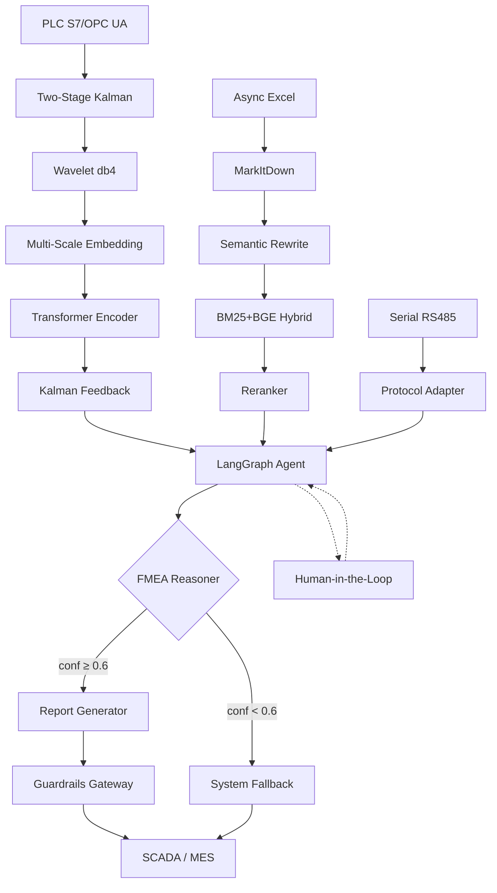

# Industrial FMEA Agent — Multi-Stage Cryogenic Distillation Intelligent Diagnostics

AI-powered predictive maintenance and FMEA (Failure Mode and Effects Analysis)
system for multi-stage cryogenic distillation equipment used in isotope enrichment.
Integrates **Siemens PLC real-time streams**, **async Excel isotope abundance reports**,
and **serial RS485 byte streams** into a unified agent loop.

## Three-Phase Evolution (2025.04 – 2026.05)

| Phase | Period | Core Technologies |
|-------|--------|-------------------|
| 1 — Foundation | 2025.04–08 | Kalman-Wavelet cascade, DTW alignment, virtual soft sensor, physics-informed anomaly detection, EWMA+KDE adaptive baseline, RAG with four-layer anti-hallucination |
| 2 — Agent | 2025.09–12 | LangGraph StateGraph agent, BM25+BGE hybrid retrieval + cross-encoder reranking, constrained decoding + Pydantic + Guardrails, QLoRA SFT + DPO alignment, AWQ INT4 quantization |
| 3 — Intelligence | 2026.01–05 | Kalman-Wavelet-Transformer cascade, Model-based RL (PPO + MCTS), counterfactual advisor, DMA/NPU edge deployment on Jetson AGX Orin |

## Architecture Overview



## Safety — Four-Layer Anti-Hallucination

1. **Constrained Decoding** — JSON Schema enforces valid tag names from asset dictionary
2. **Pydantic Validator** — runtime S×O×D=RPN consistency, known-tag enforcement
3. **Guardrails Gateway** — physical boundary checks (abundance ≤ 100%, temp > −273°C)
4. **Citation Tracker** — every diagnostic claim must cite a source; uncited = rejected

## Project Structure

```
├── src/
│   ├── signal/          # Kalman, wavelet, DTW, scalogram, soft sensor
│   ├── detection/       # Physics-informed detector, adaptive baseline, features
│   ├── rag/             # Document loader, rewriter, chunker, embedder, hybrid search, reranker, metadata filter
│   ├── safety/          # Constrained decoding, Pydantic validator, guardrails, citation tracker
│   ├── prompt/          # Topology injector, safe refusal templates
│   ├── agent/           # LangGraph state, graph, nodes, routing, context management
│   ├── training/        # SFT dataset builder, QLoRA, DPO dataset builder, DPO trainer, LoRA merge
│   ├── deploy/          # AWQ quantizer, vLLM/TensorRT-LLM configs, Jetson deploy, DMA config
│   ├── models/          # KWT cascade, multi-scale embedding, Kalman feedback
│   └── rl/              # Distillation gym env, PPO controller, MCTS planner, counterfactual advisor
├── configs/             # YAML configs for all modules
├── data/mock/           # Fictitious FMEA samples, PLC stream, serial binary
├── docs/                # Architecture docs, data anonymization notice
├── tests/               # Pytest suite
├── Dockerfile.edge      # Jetson AGX Orin container
├── Dockerfile.server    # L40S server container
├── docker-compose.yml   # Edge + server orchestration
└── requirements.txt
```

## Quick Start

```bash
pip install -r requirements.txt
pytest tests/ -v
```

## Data Anonymization Notice

**All PLC tag names, valve identifiers, column designators, and FMEA entries
are fictitious.** See `docs/data_notice.md` for details.

## License

Proprietary. For demonstration and portfolio purposes only.
