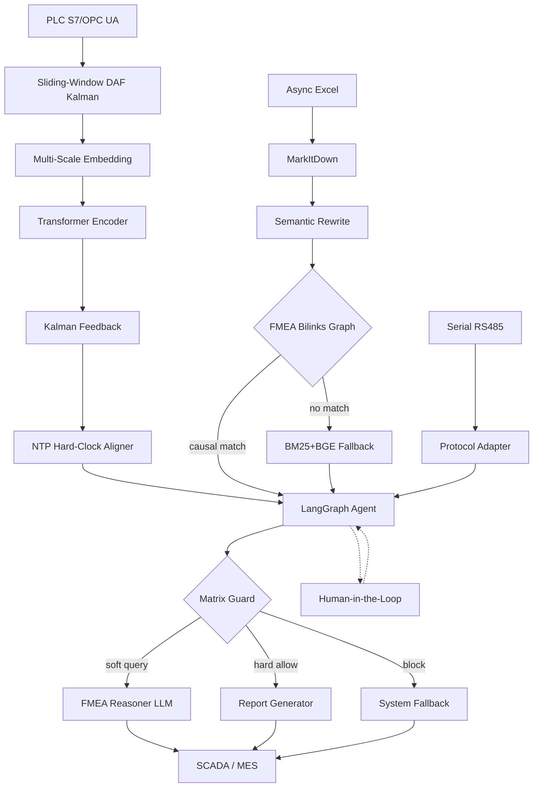

# Industrial FMEA Agent — Multi-Stage Cryogenic Distillation Intelligent Diagnostics

AI-powered predictive maintenance and FMEA (Failure Mode and Effects Analysis)
system for multi-stage cryogenic distillation equipment used in isotope enrichment.
Integrates **Siemens PLC real-time streams**, **async Excel isotope abundance reports**,
and **serial RS485 byte streams** into a unified agent loop.

## Three-Phase Evolution (2025.04 – 2026.05)

| Phase | Period | Core Technologies |
|-------|--------|-------------------|
| 1 — Foundation | 2025.04–08 | Kalman-Wavelet cascade, DTW alignment, virtual soft sensor, physics-informed anomaly detection, EWMA+KDE adaptive baseline, RAG with four-layer anti-hallucination |
| 2 — Agent | 2025.09–12 | LangGraph StateGraph agent, BM25+BGE hybrid retrieval + cross-encoder reranking, constrained decoding + Pydantic + Guardrails, QLoRA SFT + DPO alignment, AWQ INT4 quantization |
| 2b — Alg. Upgrade | 2025.12 | Sliding-window DAF annealing Kalman (replaces wavelet pre-filter), 3D boolean matrix safety gateway (replaces JSON Schema chain), FMEA Bilinks causal graph retrieval (replaces pure BM25 search), hard-clock NTP alignment (supplements DTW), raw covariance packing (Jetson DMA optimization). All zero additional hardware. |
| 3 — Intelligence | 2026.01–05 | Kalman-Wavelet-Transformer cascade, Model-based RL (PPO + MCTS), counterfactual advisor, DMA/NPU edge deployment on Jetson AGX Orin |

## Architecture Overview



## Safety — Matrix Guard with LLM Fallback

Hard safety rules (enrichment > 100%, valve position < 0%) are resolved in
nanoseconds via a 3D boolean matrix `state[device][sensor][severity]`. Only
uncertainty cases involving ambiguous causal reasoning invoke the LLM.

1. **Matrix Guard (O(1) hard gate)** — physical impossibility rules as pre-configured boolean matrix; single array lookup replaces JSON Schema + Pydantic chain
2. **FMEA Bilinks Graph** — BFS from alarming sensor, constrained to causal topology; BM25+BGE vector search retained as fallback for novel failure modes
3. **Citation Tracker** — every diagnostic claim must cite an FMEA source row; uncited = rejected

## Project Structure

```
├── src/
│   ├── signal/          # DAF Kalman (sliding-window + per-measurement), wavelet, DTW, scalogram, soft sensor, BCO hard-clock aligner
│   ├── detection/       # Physics-informed detector, adaptive baseline, features
│   ├── rag/             # Document loader, rewriter, chunker, embedder, hybrid search, reranker, metadata filter, FMEA Bilinks causal graph
│   ├── safety/          # 3D boolean matrix guard, constrained decoding, Pydantic validator, guardrails, citation tracker
│   ├── prompt/          # Topology injector, safe refusal templates
│   ├── agent/           # LangGraph state, graph, nodes, routing, context management
│   ├── training/        # SFT dataset builder, QLoRA, DPO dataset builder, DPO trainer, LoRA merge
│   ├── deploy/          # AWQ quantizer, vLLM/TensorRT-LLM configs, Jetson deploy, DMA config, raw covariance packing
│   ├── models/          # KWT cascade, multi-scale embedding, Kalman feedback
│   └── rl/              # Distillation gym env, PPO controller, MCTS planner, counterfactual advisor
├── configs/             # YAML configs for all modules
├── data/mock/           # Fictitious FMEA samples, PLC stream, serial binary
├── docs/                # Architecture docs, data anonymization notice
├── tests/               # Pytest suite
├── Dockerfile.edge      # Jetson AGX Orin container
├── Dockerfile.server    # L40S server container
├── docker-compose.yml   # Edge + server orchestration
└── requirements.txt
```

## Quick Start

```bash
pip install -r requirements.txt
pytest tests/ -v
```

## Data Anonymization Notice

**All PLC tag names, valve identifiers, column designators, and FMEA entries
are fictitious.** See `docs/data_notice.md` for details.

## License

Proprietary. For demonstration and portfolio purposes only.
