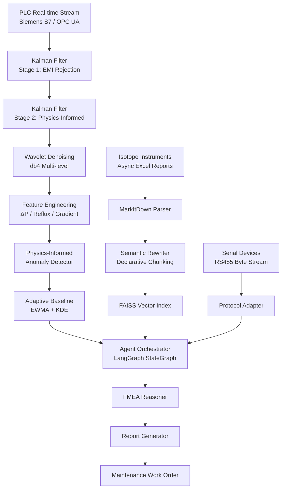

# Industrial FMEA Agent — Multi-Stage Cryogenic Distillation Intelligent Diagnostics

**Phase 1 (2025.04–2025.08): Kalman-Wavelet cascade signal processing + DTW alignment + RAG anti-hallucination**

An AI-powered predictive maintenance and FMEA (Failure Mode and Effects Analysis)
system for multi-stage cryogenic distillation equipment used in isotope enrichment.

## Architecture Overview



## Data Anonymization Notice

**All PLC tag names, valve identifiers, distillation column designators, and
FMEA entries in this repository are fictitious.** Real industrial identifiers
have been replaced with synthetic values (e.g. T-301, PT-301, FV-301).
Any resemblance to actual industrial facilities is coincidental.

## Project Structure

```
├── src/
│   ├── signal/          # Kalman filter, wavelet denoising, DTW, soft sensor
│   └── detection/       # Physics-informed anomaly detection, adaptive baseline
├── configs/
│   └── signal/          # Filter and wavelet parameter YAML configs
├── requirements.txt
└── .gitignore
```

## Technology Stack (Phase 1)

- **Signal Processing**: Two-stage Kalman filter, db4 wavelet decomposition
- **Time Alignment**: Dynamic Time Warping (DTW) with Sakoe-Chiba band
- **Virtual Sensing**: LSTM / XGBoost soft sensor for isotope abundance
- **Anomaly Detection**: Physics-informed features + EWMA/KDE adaptive baseline
- **Vector Search**: FAISS in-memory index, BGE-Large embeddings

## Quick Start

```bash
pip install -r requirements.txt
python -c "
import numpy as np
from src.signal.kalman_filter import TwoStageKalmanFilter
from src.signal.wavelet_denoise import wavelet_denoise
from src.signal.dtw_aligner import dtw_align

# Generate synthetic noisy PLC signal
t = np.linspace(0, 10, 1000)
raw = np.sin(t) + 14.0 + np.random.normal(0, 0.2, 1000)

# Filter
kf = TwoStageKalmanFilter()
filtered = np.array([kf.update(v) for v in raw])

# Denoise
clean = wavelet_denoise(raw, wavelet='db4', level=3)

print(f'Raw std: {raw.std():.3f}, Filtered std: {filtered.std():.3f}, Denoised std: {clean.std():.3f}')
"
```

## License

Proprietary. For demonstration and portfolio purposes only.
