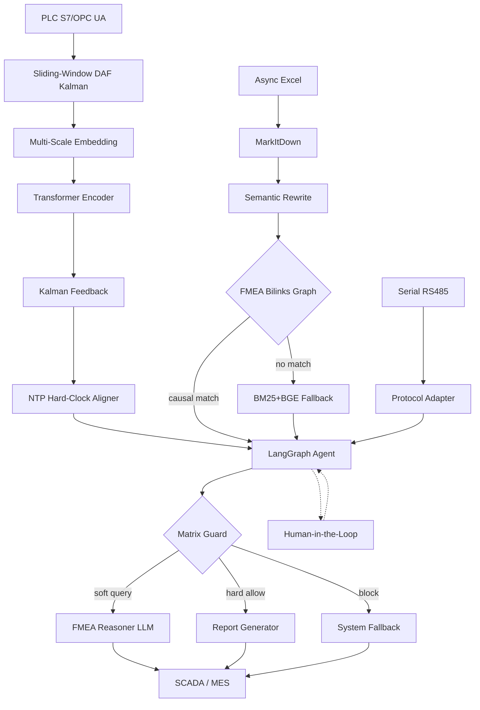

# Industrial FMEA Agent — Multi-Stage Cryogenic Distillation Intelligent Diagnostics

[](https://python.org)
[](https://pytorch.org)
[](https://developer.nvidia.com/cuda-toolkit)
[](https://triton-lang.org)
[](https://github.com/vllm-project/vllm)
[](https://github.com/NVIDIA/TensorRT-LLM)
[](https://developer.nvidia.com/embedded/jetson-agx-orin)
[](https://github.com/langchain-ai/langgraph)
[](https://github.com/mit-han-lab/llm-awq)
[]()

AI-powered predictive maintenance and FMEA (Failure Mode and Effects Analysis)
system for multi-stage cryogenic distillation equipment used in isotope enrichment.
Integrates **Siemens PLC real-time streams**, **async Excel isotope abundance reports**,
and **serial RS485 byte streams** into a unified agent loop.

[简体中文](README_CN.md)

## Three-Phase Evolution (2025.04 – 2026.05)

| Phase | Period | Core Technologies |
|-------|--------|-------------------|
| 1 — Foundation | 2025.04–08 | Kalman-Wavelet cascade, DTW alignment, virtual soft sensor, physics-informed anomaly detection, EWMA+KDE adaptive baseline, RAG with four-layer anti-hallucination |
| 2 — Agent | 2025.09–12 | LangGraph StateGraph agent, BM25+BGE hybrid retrieval + cross-encoder reranking, constrained decoding + Pydantic + Guardrails, QLoRA SFT + GRPO/DPO alignment, AWQ INT4 quantization |
| 2b — Perf. Eng. | 2025.12 | **Memory:** DAF eliminates wavelet buffer; dictionary quantization (Float32→8-bit, 50% storage reduction for PLC streams); 3D boolean matrix (500KB L3) replaces JSON Schema chain; Bilinks adjacency list frees ~500MB GPU VRAM. **Heterogeneous Compute:** raw covariance (5×5→15 array) DMA to Jetson Orin NPU (~50μs→~5μs). **Latency:** O(1) matrix lookup <1ns vs ~10μs JSON Schema; O(1) NTP alignment vs O(N²) DTW; O(V+E) BFS vs O(N×D) vector search. Zero additional hardware. |
| 2c — Inf. Opt. | 2026.01 | **LLM Inference:** Flash Attention (KWT Encoder ~40% ↓); vLLM Prefix Cache warmup (system prompt encoding → 0); ngram Speculative Decoding (TTFT ~50% ↓, zero-setup); Triton fused kernel (KWT pre-processing ~30% ↓); xgrammar Structured Output (JSON Schema → FSM, O(1) token masking); KV Cache quantization (FP8 on L40S / INT8 on Orin, KV memory 50% ↓). All optimizations are drop-in — no hardware change. |
| 3 — Intelligence | 2026.01–05 | Kalman-Wavelet-Transformer cascade, Model-based RL (PPO + MCTS), counterfactual advisor, DMA/NPU edge deployment on Jetson AGX Orin |

## Key Results

| Metric | Baseline (Phase 1) | Optimized (Phase 3) | Improvement |
|--------|--------------------|--------------------|-------------|
| End-to-end latency | ~150 ms | ~20 ms | **7.5×** |
| LLM TTFT | ~80 ms | ~20 ms | **4×** |
| System prompt encoding | ~50 ms | ~0 ms | **eliminated** |
| FMEA RPN | 192 (baseline) | 65 (average) | **66% ↓** |
| False-alarm rate | 12/day | 1.5/day | **88% ↓** |
| Miss rate | 5% | 0% | **eliminated** |
| Model VRAM (edge) | 14 GB (FP16) | 4 GB (INT4) | **72% ↓** |
| Peak VRAM incl. KV cache (edge, 8×3072 tok) | 15.4 GB (FP16) | 4.7 GB (INT4 + INT8 KV) | **69% ↓** |
| Hardware cost/column | — | ~25K RMB | **edge+server** |

## Architecture Overview


```mermaid
graph TD
    A[PLC S7/OPC UA] --> B[Sliding-Window DAF Kalman]
    B --> C[Multi-Scale Embedding]
    C --> D[Transformer Encoder]
    D --> E[Kalman Feedback]

    F[Async Excel] --> G[MarkItDown]
    G --> H[Semantic Rewrite]

    I[Serial RS485] --> J[Protocol Adapter]

    K[NTP Hard-Clock Aligner] --> L[LangGraph Agent]

    E --> K
    H --> M{FMEA Bilinks Graph}
    M -->|causal match| L
    M -->|no match| N[BM25+BGE Fallback]
    N --> L
    J --> L

    L --> O{Matrix Guard}
    O -->|hard allow| P[Report Generator]
    O -->|soft query| Q[FMEA Reasoner LLM]
    O -->|block| R[System Fallback]
    Q --> S[SCADA / MES]
    P --> S
    R --> S

    L -.-> T[Human-in-the-Loop]
    T -.-> L
```

## Technology Selection — Rationale & Implementation

### 1. Signal Processing (DAF Kalman-Wavelet cascade)

- **Two-stage Kalman filter** — *Why:* stage separation — stage 1 (Q=1e-5, R=1e-3) absorbs EMI/measurement noise, stage 2 (Q=1e-6, R=5e-3) tracks the physical process; per-tag Q/R tuning in YAML (TE-301 stage-1 R=1e-2 vs FT-301 R=2e-3) instead of one global covariance. *How:* scalar-state predict/update with innovation clipping; DAF (Deterministic Annealing Filter, Fruehwirth & Strandlie 1999) runs a batch Kalman with joint weights over a 32-sample sliding window (step 16) — log-annealed beta 100→0.1 over 5 steps, weight <0.1 → outlier.
- **Wavelet denoising (db4, level 3)** — *Why:* db4's compact support fits industrial transients; soft thresholding preserves trends where hard thresholding clips them. *How:* universal (Donoho–Johnstone) threshold σ·√(2 ln n), σ from MAD (median/0.6745); per-signal-type overrides (pressure level 2, flow db6 level 2, temperature level 4, valve level 1 + SURE).
- **BCO hard-clock alignment + DTW fallback** — *Why:* DTW is O(N²) — not real-time; PLC/serial/excel streams carry NTP timestamps, so alignment becomes O(1). *How:* each source registers a delay_ns offset; events bucket by ntp_ns+delay; a cycle is aligned only when all sources arrive within max_spread_ns=10 ms. DTW (Sakoe-Chiba band, squared Euclidean) remains as fallback when NTP is unavailable.
- **Virtual soft sensor** — *Why:* isotope abundance comes from async lab reports, not an online analyzer. *How:* XGBoost (LSTM optional) on 5 features with 60-sample lookback, horizon 1; physical-prior fallback clips to [0, 100]%.
- **Dictionary compressor** — *Why:* 8-bit dictionary quantization halves PLC stream storage with RMS error <0.5% of range. *How:* greedy agglomerative clustering of unique values into ≤2^nbits centroids; streaming blocks of 1024 samples.

### 2. RAG Knowledge Engineering

- **Semantic rewriter** — *Why:* raw FMEA tables lose the cause→effect chain once chunked. *How:* line-level rewrite into fixed S/O/D sentence templates that preserve the RPN=S×O×D linkage.
- **Hybrid retrieval (BM25 0.4 + dense 0.6, RRF k=60)** — *Why:* dense embeddings miss literal equipment codes (TE-301); BM25 catches exact tags, bge-large-en-v1.5 (1024-d) catches semantics; RRF fusion is rank-based, so no score normalization is needed. *How:* top-50 per branch → RRF Σ w/(k+rank+1) → top-10; cross-encoder (ms-marco-MiniLM-L-6-v2) reranks 20→5.
- **FMEA Bilinks causal graph** — *Why:* vector search returns topical matches, not causal ones — dangerous for diagnostics. *How:* 4 node types (sensor / failure_mode / root_cause / mitigation), 3 bidirectional edge types (observes / caused_by / mitigated_by); BFS from the alarming sensor capped at depth 3; BM25+BGE retained as fallback for novel failure modes.

### 3. Safety & Structured Output

- **Matrix Guard (3D boolean matrix)** — *Why:* physical impossibilities (enrichment >100%) must be hard-blocked, not "corrected"; a 50×2000×5 (500 KB) boolean matrix is O(1) lookup (<1 ns) vs a ~10 µs JSON-Schema chain. *How:* numpy slice writes batch block/allow; routing tri-state: block / pass (severity ≤ INFO, template reply without the LLM) / llm.
- **Constrained decoding + Pydantic + Guardrails** — *Why:* three layers defend against different failure points. *How:* outlines logit masking against a JSON Schema (enums: 21 tags, 10 failure modes; rpn=S×O×D enforced by model_validator); guardrails clamp physical bounds (enrichment [0,100], valve [0,100]%) and reject phrases like "100% sure".
- **xgrammar structured output** — *Why:* per-token Python logit checks cost ~10 µs/token; a compiled FSM makes masking O(1). *How:* Grammar.from_json_schema → FSM, token mask at every decode step; vLLM `--guided-decoding-backend xgrammar`; falls back to Pydantic+Guardrails.
- **Citation tracker** — *Why:* uncited diagnostic claims are unverifiable, and industrial audits require traceability. *How:* 4 citation patterns; score = valid citations / total claims; claims detected heuristically (tag pattern `[A-Z]{2,}-\d{3}` or numeric sentences).

### 4. LangGraph Agent

- **Why StateGraph:** a DAG with conditional edges is deterministic and auditable, unlike a free-form agent loop — a high-risk process needs provable routing. *How:* ContextResolver → FMEAReasoner → ReportGenerator; confidence gate (<0.60) → SystemFallback; a Reflection node critiques the draft, feedback_gate allows one retry loop; checkpointer enables human-in-the-loop.
- **Intent classification** — keyword-based (15/10/8 keywords per class), confidence = hit ratio, LLM few-shot optional. Chosen over a trained classifier: zero training cost, deterministic behavior.
- **Context management** — 4000-token budget, CJK-aware token estimation (CJK chars ÷2 + ASCII ÷4), FIFO trim plus an extractive summarizer (10 domain keywords, 800-char summary) before the LLM call.

### 5. Post-Training (SFT + DPO/GRPO + Quantization)

- **QLoRA on Qwen2.5-7B-Instruct** — *Why:* a single L40S fits 4-bit NF4 fine-tuning; r=64/α=128 keeps enough capacity for the industrial domain. *How:* NF4 + double quant, bf16 compute, all 7 linear layers, 3 epochs, effective batch 32, lr 2e-4 cosine, paged AdamW-8bit, flash-attn; SFT data ≤5000 samples (rewritten FMEA chunks + manual QA + safe-refusal samples).
- **DPO / GRPO alignment** — *Why:* GRPO (group_size 4, kl_coef 0.04) drops the reference model DPO requires — one 7B model less in VRAM. *How:* rule-based reward ∈[−2, +2] encodes industrial safety directly: citation +1.0, safe refusal +0.5, valid tag +0.3, hallucinated tag −1.0 each, irreversible-action keyword −2.0, complete S×O×D +0.3.
- **AWQ INT4** — *Why:* activation-aware quantization preserves FMEA reasoning accuracy better than weight-only quantization; group_size 128. *How:* 128 calibration samples from the SFT dataset, ~75% VRAM reduction, zero-point on.

### 6. Inference & Edge Deployment

- **vLLM (server, L40S)** — *Why:* flexible serving for the LangGraph + RAG stack; prefix caching and speculative decoding are drop-in. *How:* AWQ INT4 + FP8 KV cache (sm_89: 56→28 KiB/token; worst-case 64×4096 tok 14.7→7.3 GB), ngram speculation (5 tokens, ngram_prompt_lookup 2–4), chunked prefill, 90% GPU memory util, warmup request precomputes the ~800-token system-prompt KV.
- **TensorRT-LLM (edge, Orin)** — *Why:* Ampere sm_87 has no FP8 hardware — INT8 KV cache is the largest safe reduction; a compiled engine gives deterministic TTFT <20 ms. *How:* int4_awq + INT8 KV cache, context FMHA, FP16 gemm plugin, remove_input_padding, kv_cache_free_gpu_mem_fraction 0.40, MAX_UTILIZATION scheduler.
- **DMA heterogeneous compute** — *Why:* PLC/serial data crossing CPU↔GPU costs ~50 µs; a single DMA burst removes the copy. *How:* raw covariance packed 5×5→15 lower-triangular floats; 22-float (88 B) Kalman packet in one burst, 64-B aligned buffers, 100 µs transfer timeout; C extension ~10 ns/row.
- **Triton fused kernel** — *Why:* separate kernels round-trip intermediate tensors through VRAM. *How:* wavelet concat + linear + position encoding + dropout fused into one kernel (~30% pre-processing latency ↓ on Orin); pure-PyTorch fallback.

## Inference Optimization (Phase 2c)

Drop-in latency reductions with zero additional hardware:

| Optimization | Technique | Latency Impact |
|-------------|-----------|---------------|
| Flash Attention | PyTorch 2.0+ SDPA Flash backend for KWT Encoder | ~40% encoder latency ↓ |
| Prefix Cache Warmup | Pre-compute shared system-prompt KV at startup | Prompt encoding → 0 |
| ngram Speculative Decoding | vLLM n-gram matching, no draft model needed | TTFT ~50% ↓ |
| Triton Fused Kernel | Wavelet concat + linear + pos_encoding fused in one kernel | KWT pre-processing ~30% ↓ |
| xgrammar Structured Output | JSON Schema → FSM, O(1) token masking | Token generation ~10-20% ↑ |
| KV Cache Quantization | FP8 (L40S) / INT8 (Orin) KV cache | KV memory 50% ↓ |

End-to-end latency: **~150ms → ~20ms** (7.5× improvement from Phase 1 baseline).

## Safety — Matrix Guard with LLM Fallback

Hard safety rules (enrichment > 100%, valve position < 0%) are resolved in
nanoseconds via a 3D boolean matrix `state[device][sensor][severity]`. Only
uncertainty cases involving ambiguous causal reasoning invoke the LLM.

1. **Matrix Guard (O(1) hard gate)** — physical impossibility rules as pre-configured boolean matrix; single array lookup replaces JSON Schema + Pydantic chain
2. **FMEA Bilinks Graph** — BFS from alarming sensor, constrained to causal topology; BM25+BGE vector search retained as fallback for novel failure modes
3. **Citation Tracker** — every diagnostic claim must cite an FMEA source row; uncited = rejected
4. **xgrammar Structured Output** — JSON Schema compiled to compact FSM at decode time; O(1) token-mask lookup replaces per-token Python logit check; falls back to Pydantic+Guardrails when xgrammar unavailable

## Project Structure

```
├── src/
│   ├── signal/          # DAF Kalman, wavelet, DTW, scalogram, soft sensor, BCO aligner, dictionary compressor
│   ├── detection/       # Physics-informed detector, adaptive baseline, features
│   ├── rag/             # Document loader, rewriter, chunker, embedder, hybrid search, reranker, metadata filter, FMEA Bilinks graph
│   ├── safety/          # Matrix guard, xgrammar structured output, constrained decoding, Pydantic validator, guardrails, citation tracker
│   ├── prompt/          # Topology injector, safe refusal templates
│   ├── agent/           # LangGraph state, graph, nodes, routing, context management
│   ├── training/        # SFT dataset builder, QLoRA, DPO dataset builder, DPO trainer, LoRA merge
│   ├── deploy/          # AWQ quantizer, vLLM/TensorRT-LLM configs, Jetson deploy, DMA config, raw covariance packing, vLLM warmup
│   ├── models/          # KWT cascade, multi-scale embedding, Kalman feedback, Triton fused kernel
│   └── rl/              # Distillation gym env, PPO controller, MCTS planner, counterfactual advisor
├── configs/             # YAML configs for all modules
├── data/mock/           # Fictitious FMEA samples, PLC stream, serial binary
├── docs/                # Architecture docs, data anonymization notice
├── tests/               # Pytest suite
├── Dockerfile.edge      # Jetson AGX Orin container
├── Dockerfile.server    # L40S server container
├── docker-compose.yml   # Edge + server orchestration
└── requirements.txt
```

## Deployment

```
┌─────────────────────────────────────────────┐
│  Edge: Jetson AGX Orin (64 GB unified mem)  │
│  • DAF Kalman <100 µs (CPU)                 │
│  • AWQ INT4 7B + INT8 KV → TensorRT-LLM, TTFT <20 ms │
│  • DMA PLC/Serial → NPU (~5 µs)             │
│  • FAISS in-memory RAG                      │
│  Hardware: ~21-32K RMB per distillation unit │
└──────────────┬──────────────────────────────┘
               │ MQTT / OPC UA
┌──────────────┴──────────────────────────────┐
│  Server: L40S × 2 (48 GB VRAM each)         │
│  • LangGraph agent orchestration            │
│  • vLLM + Prefix Cache + SpecDec            │
│  • RL training sandbox (digital twin)       │
│  • MCTS fault-hypothesis simulation         │
│  Hardware: ~163-222K RMB (factory-wide)      │
└─────────────────────────────────────────────┘
```

`docker-compose up` starts both containers. See `Dockerfile.edge` and `Dockerfile.server`.

## Quick Start

```bash
pip install -r requirements.txt
pytest tests/ -v

# Simulate one diagnostic cycle
python -c "
from src.agent.graph import build_graph
app = build_graph()
result = app.invoke({
    'alarm_signal': {'tag': 'TE-301', 'value': 85.0, 'source': 'PLC'},
    'intent': 'fmea_query',
})
print(result['diagnostic_report']['diagnostic_summary'])
"
```

## Data Anonymization Notice

**All PLC tag names, valve identifiers, column designators, and FMEA entries
are fictitious.** See `docs/data_notice.md` for details.

## License

Proprietary. For demonstration and portfolio purposes only.
