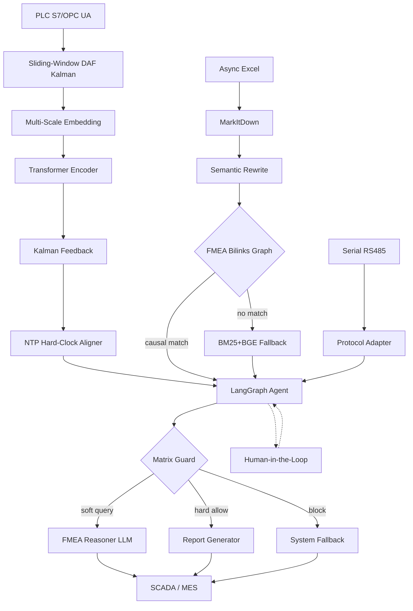

# Industrial FMEA Agent — Multi-Stage Cryogenic Distillation Intelligent Diagnostics

AI-powered predictive maintenance and FMEA (Failure Mode and Effects Analysis)
system for multi-stage cryogenic distillation equipment used in isotope enrichment.
Integrates **Siemens PLC real-time streams**, **async Excel isotope abundance reports**,
and **serial RS485 byte streams** into a unified agent loop.

## Three-Phase Evolution (2025.04 – 2026.05)

| Phase | Period | Core Technologies |
|-------|--------|-------------------|
| 1 — Foundation | 2025.04–08 | Kalman-Wavelet cascade, DTW alignment, virtual soft sensor, physics-informed anomaly detection, EWMA+KDE adaptive baseline, RAG with four-layer anti-hallucination |
| 2 — Agent | 2025.09–12 | LangGraph StateGraph agent, BM25+BGE hybrid retrieval + cross-encoder reranking, constrained decoding + Pydantic + Guardrails, QLoRA SFT + DPO alignment, AWQ INT4 quantization |
| 2b — Perf. Eng. | 2025.12 | **Memory:** DAF eliminates wavelet buffer; dictionary quantization (Float32→8-bit, 50% storage reduction for PLC streams); 3D boolean matrix (500KB L3) replaces JSON Schema chain; Bilinks adjacency list frees ~500MB GPU VRAM. **Heterogeneous Compute:** raw covariance (5×5→15 array) DMA to Jetson Orin NPU (~50μs→~5μs). **Latency:** O(1) matrix lookup <1ns vs ~10μs JSON Schema; O(1) NTP alignment vs O(N²) DTW; O(V+E) BFS vs O(N×D) vector search. Zero additional hardware. |
| 2c — Inf. Opt. | 2026.01 | **LLM Inference:** Flash Attention (KWT Encoder ~40% ↓); vLLM Prefix Cache warmup (system prompt encoding → 0); ngram Speculative Decoding (TTFT ~50% ↓, zero-setup); Triton fused kernel (KWT pre-processing ~30% ↓); xgrammar Structured Output (JSON Schema → FSM, O(1) token masking). All optimizations are drop-in — no hardware change. |
| 3 — Intelligence | 2026.01–05 | Kalman-Wavelet-Transformer cascade, Model-based RL (PPO + MCTS), counterfactual advisor, DMA/NPU edge deployment on Jetson AGX Orin |

## Architecture Overview


```mermaid
graph TD
    A[PLC S7/OPC UA] --> B[Sliding-Window DAF Kalman]
    B --> C[Multi-Scale Embedding]
    C --> D[Transformer Encoder]
    D --> E[Kalman Feedback]

    F[Async Excel] --> G[MarkItDown]
    G --> H[Semantic Rewrite]

    I[Serial RS485] --> J[Protocol Adapter]

    K[NTP Hard-Clock Aligner] --> L[LangGraph Agent]

    E --> K
    H --> M{FMEA Bilinks Graph}
    M -->|causal match| L
    M -->|no match| N[BM25+BGE Fallback]
    N --> L
    J --> L

    L --> O{Matrix Guard}
    O -->|hard allow| P[Report Generator]
    O -->|soft query| Q[FMEA Reasoner LLM]
    O -->|block| R[System Fallback]
    Q --> S[SCADA / MES]
    P --> S
    R --> S

    L -.-> T[Human-in-the-Loop]
    T -.-> L
```

## Inference Optimization (Phase 2c)

Drop-in latency reductions with zero additional hardware:

| Optimization | Technique | Latency Impact |
|-------------|-----------|---------------|
| Flash Attention | PyTorch 2.0+ SDPA Flash backend for KWT Encoder | ~40% encoder latency ↓ |
| Prefix Cache Warmup | Pre-compute shared system-prompt KV at startup | Prompt encoding → 0 |
| ngram Speculative Decoding | vLLM n-gram matching, no draft model needed | TTFT ~50% ↓ |
| Triton Fused Kernel | Wavelet concat + linear + pos_encoding fused in one kernel | KWT pre-processing ~30% ↓ |
| xgrammar Structured Output | JSON Schema → FSM, O(1) token masking | Token generation ~10-20% ↑ |

End-to-end latency: **~150ms → ~20ms** (7.5× improvement from Phase 1 baseline).

## Safety — Matrix Guard with LLM Fallback

Hard safety rules (enrichment > 100%, valve position < 0%) are resolved in
nanoseconds via a 3D boolean matrix `state[device][sensor][severity]`. Only
uncertainty cases involving ambiguous causal reasoning invoke the LLM.

1. **Matrix Guard (O(1) hard gate)** — physical impossibility rules as pre-configured boolean matrix; single array lookup replaces JSON Schema + Pydantic chain
2. **FMEA Bilinks Graph** — BFS from alarming sensor, constrained to causal topology; BM25+BGE vector search retained as fallback for novel failure modes
3. **Citation Tracker** — every diagnostic claim must cite an FMEA source row; uncited = rejected
4. **xgrammar Structured Output** — JSON Schema compiled to compact FSM at decode time; O(1) token-mask lookup replaces per-token Python logit check; falls back to Pydantic+Guardrails when xgrammar unavailable

## Project Structure

```
├── src/
│   ├── signal/          # DAF Kalman, wavelet, DTW, scalogram, soft sensor, BCO aligner, dictionary compressor
│   ├── detection/       # Physics-informed detector, adaptive baseline, features
│   ├── rag/             # Document loader, rewriter, chunker, embedder, hybrid search, reranker, metadata filter, FMEA Bilinks graph
│   ├── safety/          # Matrix guard, xgrammar structured output, constrained decoding, Pydantic validator, guardrails, citation tracker
│   ├── prompt/          # Topology injector, safe refusal templates
│   ├── agent/           # LangGraph state, graph, nodes, routing, context management
│   ├── training/        # SFT dataset builder, QLoRA, DPO dataset builder, DPO trainer, LoRA merge
│   ├── deploy/          # AWQ quantizer, vLLM/TensorRT-LLM configs, Jetson deploy, DMA config, raw covariance packing, vLLM warmup
│   ├── models/          # KWT cascade, multi-scale embedding, Kalman feedback, Triton fused kernel
│   └── rl/              # Distillation gym env, PPO controller, MCTS planner, counterfactual advisor
├── configs/             # YAML configs for all modules
├── data/mock/           # Fictitious FMEA samples, PLC stream, serial binary
├── docs/                # Architecture docs, data anonymization notice
├── tests/               # Pytest suite
├── Dockerfile.edge      # Jetson AGX Orin container
├── Dockerfile.server    # L40S server container
├── docker-compose.yml   # Edge + server orchestration
└── requirements.txt
```

## Quick Start

```bash
pip install -r requirements.txt
pytest tests/ -v
```

## Data Anonymization Notice

**All PLC tag names, valve identifiers, column designators, and FMEA entries
are fictitious.** See `docs/data_notice.md` for details.

## License

Proprietary. For demonstration and portfolio purposes only.
